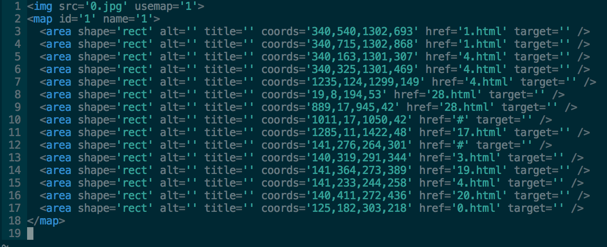

Sketch Image Mapper
=========

Create HTML image maps directly from Sketch. Turn your artboards into this:

Installation
----
1. Download and save "Export Image Maps.sketchplugin"
2. Double-click on the downloaded file. This action will automatically import the plugin into sketch and add an option to the plugin menu bar.

Usage
----
1. Prepend "&" to the title of each layer (or group) that you wish to generate a clickable region for. 
2. Select "Export Image Maps" from the plugin menu bar.
3. Open the generated HTML files and modify the hyperlinks.

Known Issues
----
Sketch files with many layers (400+) will likely cause Sketch to crash while generating the image maps. If you are facing this issue, duplicate your Sketch file and flatten to bitmap layers that aren't marked with an ampersand. Continue doing so until the plugin runs to completion.

To-Do
----
1. Build in a mechanism to link mapped regions to artboards. For example, a layer with the title "&Home View&Rectangle 5" in artboard "Dashboard View" will create a clickable region over the area of that layer that links to the "Home View" artboard. 
